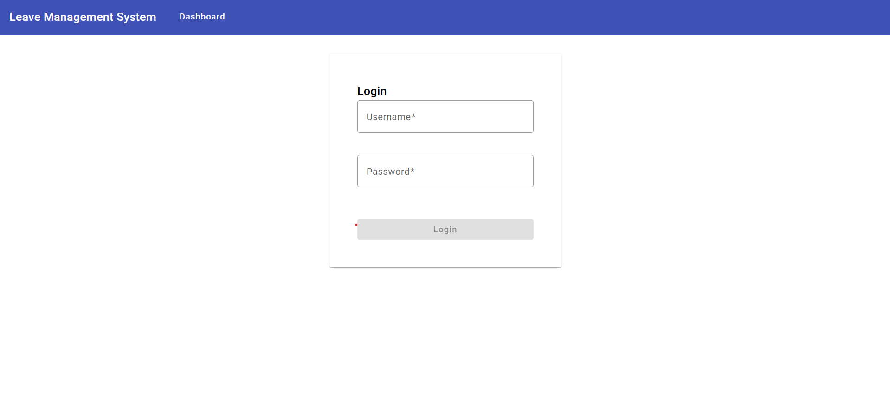

# EmployeeLeaveApp

## Prerequisites

- Node.js (v18+)
- Angular CLI (v17+)
- Git (for cloning)

## How to Clone & Run the App

 - install Angular CLI (if missing)
   npm install -g @angular/cli@17

 - Clone the Repository
   git clone https://github.com/your-repo/angular-lms.git

- Install Dependencies
  npm install

- Run the Development Server
  ng serve

## How to Login

- User Login

 1- Go to /login

 2- Enter:
    Email: mahmoud@123
    Password: mahmoud123

- User Login
 1- Go to /login

 2- Enter:
    Email: admin@123
    Password: admin123

